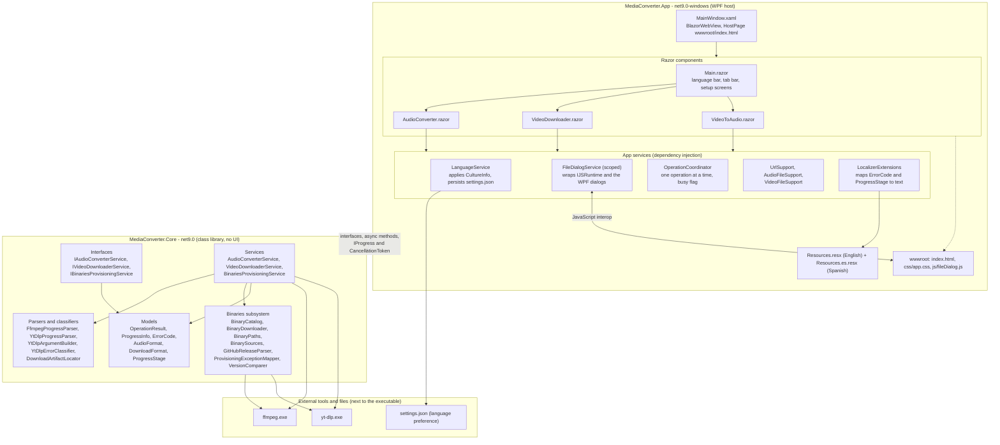

# Architecture

Layered view of the solution. The dependency direction is strictly one way: the App depends on
Core, and Core depends on nothing (no WPF, no Blazor, no UI types).

The golden rule: Core never knows a UI exists. It exposes interfaces, async methods, progress through
`IProgress<ProgressInfo>` and cancellation through `CancellationToken`, and it reports failures as
machine-readable `ErrorCode` values. The App translates those codes into the active language, so Core
stays free of user-facing strings.
