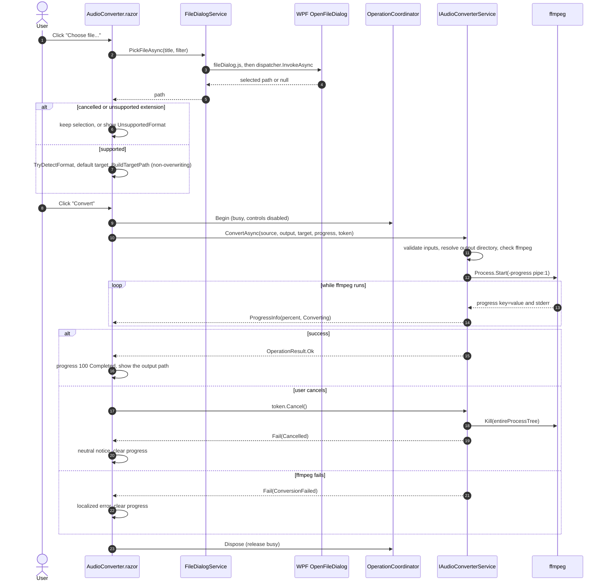

# Audio conversion

Sequence for the Audio tab, from picking a file to a finished M4A to MP3 (or MP3 to M4A) conversion.
The same service powers the video-to-audio tab.

```mermaid
sequenceDiagram
    autonumber
    actor User
    participant Tab as AudioConverter.razor
    participant Dialogs as FileDialogService
    participant Wpf as WPF OpenFileDialog
    participant Coordinator as OperationCoordinator
    participant Core as IAudioConverterService
    participant Ffmpeg as ffmpeg

    User->>Tab: Click "Choose file..."
    Tab->>Dialogs: PickFileAsync(title, filter)
    Dialogs->>Wpf: fileDialog.js, then dispatcher.InvokeAsync
    Wpf-->>Dialogs: selected path or null
    Dialogs-->>Tab: path
    alt cancelled or unsupported extension
        Tab->>Tab: keep selection, or show UnsupportedFormat
    else supported
        Tab->>Tab: TryDetectFormat, default target, BuildTargetPath (non-overwriting)
    end

    User->>Tab: Click "Convert"
    Tab->>Coordinator: Begin (busy, controls disabled)
    Tab->>Core: ConvertAsync(source, output, target, progress, token)
    Core->>Core: validate inputs, resolve output directory, check ffmpeg
    Core->>Ffmpeg: Process.Start(-progress pipe:1)
    loop while ffmpeg runs
        Ffmpeg-->>Core: progress key=value and stderr
        Core-->>Tab: ProgressInfo(percent, Converting)
    end
    alt success
        Core-->>Tab: OperationResult.Ok
        Tab->>Tab: progress 100 Completed, show the output path
    else user cancels
        Tab->>Core: token.Cancel()
        Core->>Ffmpeg: Kill(entireProcessTree)
        Core-->>Tab: Fail(Cancelled)
        Tab->>Tab: neutral notice, clear progress
    else ffmpeg fails
        Core-->>Tab: Fail(ConversionFailed)
        Tab->>Tab: localized error, clear progress
    end
    Tab->>Coordinator: Dispose (release busy)
```
