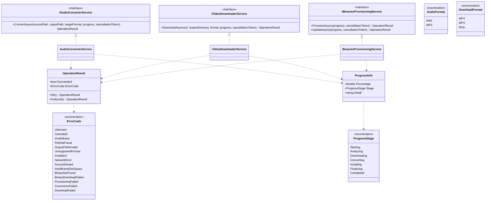

# Core components

Class view of MediaConverter.Core. Core references no WPF or Blazor types, so it can be tested in
isolation and reused from any host.

## Helper types

- Audio pipeline: `FfmpegProgressParser` parses ffmpeg `-progress pipe:1` output into a percentage.
- Download pipeline: `YtDlpArgumentBuilder` builds the yt-dlp arguments, `YtDlpProgressParser`
  parses its progress lines, `YtDlpErrorClassifier` maps stderr to an `ErrorCode`, and
  `DownloadArtifactLocator` finds the single file yt-dlp produced.
- Binaries subsystem: `BinaryCatalog` and `BinaryDefinition` describe what to download,
  `BinaryDownloader` performs the HTTP work, `BinarySources` and `GitHubReleaseParser` resolve
  versions, `BinaryPaths` resolves where the binaries live, `ProvisioningExceptionMapper` maps
  exceptions to `ErrorCode`, and `VersionComparer` decides when an update is needed.
