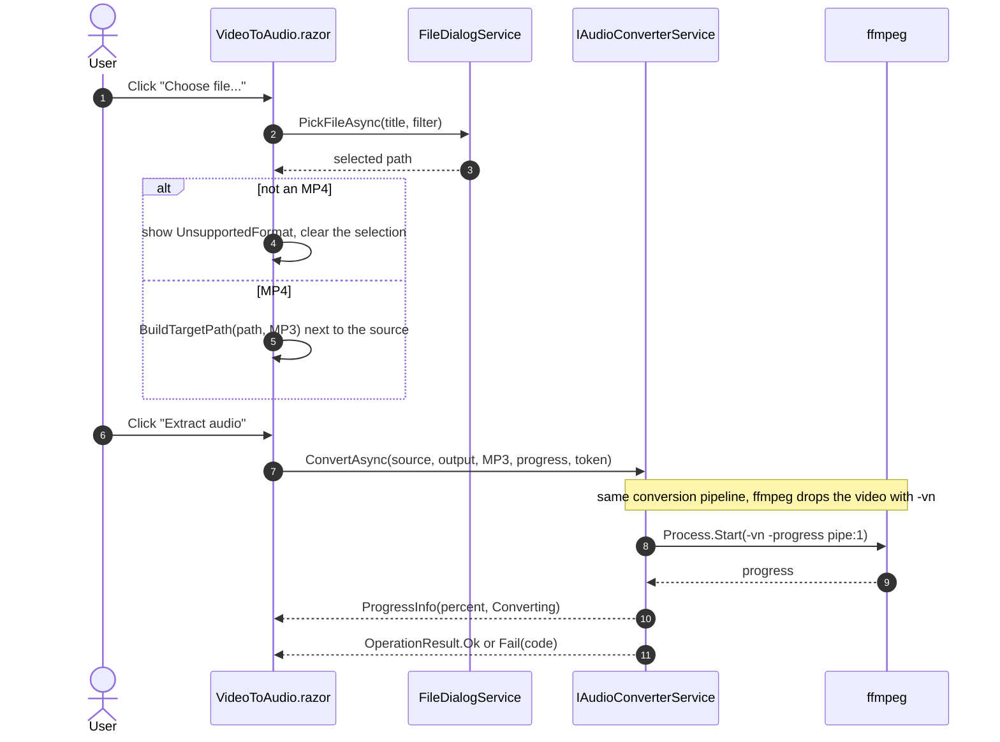

# Video to audio

Sequence for the Video to audio tab. It reuses `IAudioConverterService`: ffmpeg discards the video
stream with `-vn`, so an MP4 source follows the exact same code path as an audio file.

